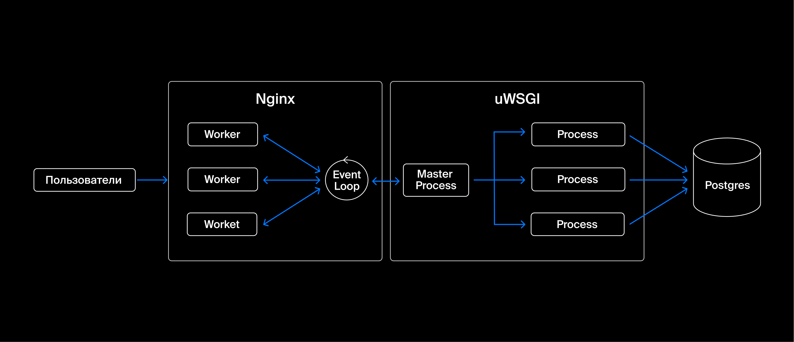

# Админка для команды контента

## Основные компоненты системы
- Cервер WSGI/ASGI — сервер с запущенным приложением.
- Nginx — прокси-сервер и сервер для отдачи статики, который является точкой входа для веб-приложения.
- PostgreSQL — реляционное хранилище данных.

## Схема сервиса


## Используемые технологии
- Django
- Django REST Framework
- PostgreSQL

### Первый запуск

1. Сначала необходимо запустить контейнер с постгресом и проинициализировать бд
```shell
sudo docker-compose up db
```
2. После успешной инициализации бд необходимо собрать контейнер со скриптом выгрузки данных
и запустить этот скрипт
```shell
sudo docker-compose up --build etl
```
3. Далее необходимо собрать контейнер с приложением на джанго
```shell
sudo docker-compose up --build app
```
4. Собрать всю статику в директории movies_admin/static
```shell
sudo docker exec -it admin-app python manage.py collectstatic
```
5. Далее необходимо собрать контейнер с nginx
```shell
sudo docker-compose up --build nginx
```
6. В браузере зайти в админку джанго http://0.0.0.0/admin
   - суперюзер - login: root, pass: 1
   - админ - login: admin, pass: 1
7. Документация по API доступна только админам и находится тут http://0.0.0.0/api/docs/

### Последующие запуски
1. Поднимаем контейнер с nginx
```shell
sudo docker-compose up nginx
```
2. Повторяем пункты 6-7 из предыдущей инструкции

